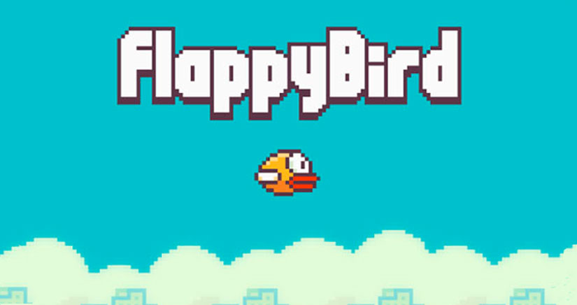

  

## English 🇺🇸 

<h1 align="center">Introduction</h1>

I've always been curious about what it's like to develop a game, then why not challenge me a build one myself? And this repository is the result, my own [FlappyBird](https://en.wikipedia.org/wiki/Flappy_Bird). It was developed using just Javascript, HTML (Canvas) and CSS.

Did you feel like playing? Just [click here](https://higoncesar.github.io/canvas-flappy-bird/) and enjoy.

  

<h1 align="center">Challenges and Learnings</h1>

The bigger challenger was learning how to solve collision problem and the criate "infinity" obstacles (pairs pipes). But all of this is more easy when understand and account frames per seconds (FPS);
 
 
 

## Português 🇧🇷

<h1 align="center">Introdução</h1>

Sempre tive curiosidade sobre como é desenvolver um jogo, então porque não me  desafiar a construir um eu mesmo? E este repositorio é o resultado, meu próprio [FlappyBird](https://pt.wikipedia.org/wiki/Flappy_Bird). Que foi desenvolvido utilizando apenas Javascrip, HTML (Canvas) e CSS. 

Ficou deu vontade de jogar? Então é só [clicar aqui](https://higoncesar.github.io/canvas-flappy-bird/) e se divertir. 

  

<h1 align="center">Desafios / Aprendizados</h1>

O maior desafio foi aprender a resolver o problema de colisão e a criação "infinitas" de obstáculos (pares de canos). Mas isso tudo se torna fácil de resolver ao entender e contabilizar quadros por segundo (FPS).

